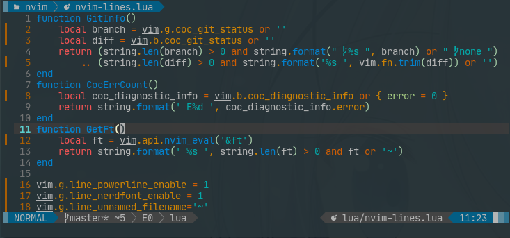
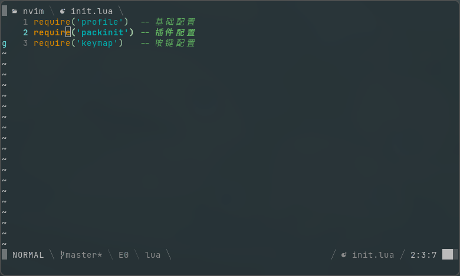

# NVIM LINES LUA

simple statusline & tabline plug of nvim  

This plugin requires neovim nightly (>=0.5.0).



show custom statusline and tabline  

my custom config [lua/pack/nvim-lines.lua](https://github.com/yaocccc/nvim/blob/master/lua/pack/nvim-lines.lua)



## EXAMPLE CONFIG

./init.vim
```vimscript
call plug#begin('~/.config/nvim/plugged')
    Plug 'yaocccc/nvim-lines.lua'
call plug#end()
lua require'nvim-lines'
```

./lua/nvim-lines.lua
```lua
vim.g.line_powerline_enable = 1
vim.g.line_nerdfont_enable = 1
vim.g.line_unnamed_filename='~'
vim.g.line_statusline_getters = {'v:lua.GitInfo', 'v:lua.CocErrCount', 'v:lua.GetFt'}
-- git status base by coc-git
function GitInfo()
    local branch = vim.g.coc_git_status or ''
    local diff = vim.b.coc_git_status or ''
    return (string.len(branch) > 0 and string.format(" %s ", branch) or " none ")
        .. (string.len(diff) > 0 and string.format('%s ', vim.fn.trim(diff)) or '')
end
-- diagnostic info base by coc
function CocErrCount()
    local coc_diagnostic_info = vim.b.coc_diagnostic_info or { error = 0 }
    return string.format(' E%d ', coc_diagnostic_info.error)
end
-- show ft
function GetFt()
    local ft = vim.api.nvim_eval('&ft')
    return string.format(' %s ', string.len(ft) > 0 and ft or '~')
end
```

## options

```options
default_options
  let g:line_statusline_enable = 1          # statusline on/off
  let g:line_tabline_enable = 1             # tabline    on/off
  let g:line_powerline_enable = 0           # statusline & tabline show powerline font
  let g:line_nerdfont_enable = 0            # statusline & tabline show nerd font
  let g:line_dclick_interval = 100          # tabline    dclick can close buffer
  let g:line_modi_mark = '+'                # tabline    modified mark
  let g:line_unnamed_filename = '[unnamed]' # statusline & tabline unnamed filename
  let g:line_statusline_getters = []        # statusline extra some info on statusline getters
  let g:line_mode_map = {"n": "NORMAL",     # statusline mode & display map
                      \  "v": "VISUAL",
                      \  "V": "V-LINE",
                      \  "\<c-v>": "V-CODE",
                      \  "i": "INSERT",
                      \  "R": "R",
                      \  "r": "R",
                      \  "Rv": "V-REPLACE",
                      \  "c": "CMD-IN",
                      \  "s": "SELECT",
                      \  "S": "SELECT",
                      \  "\<c-s>": "SELECT",
                      \  "t": "TERMINAL"}
  let g:line_hl = { 'none': 'NONE', 'light': '24', 'dark': '238', 'break': '244', 'space': '238' } # highlight config
  let g.line_percent_bar = [                # statusline percent_bar symbols
    \   '░░░',
    \   '▒░░',
    \   '█░░',
    \   '█▒░',
    \   '██░',
    \   '██▒',
    \   '███'
    \ ]
  let g.line_statusline_headsymbol = '▒'    # statusline head symbol
  let g.line_tabline_headsymbol = '▒'       # tabline head symbol
```

```usage
if you want to add something to you statusline:

Example:
  let g:line_statusline_getters = ['CocErrCount', 'GitStatus', 'GitInfo']

  coc-diagnostic:
    func! CocErrCount()
        let l:info = get(b:, 'coc_diagnostic_info', {})
        return printf(' E%d ', get(l:info, 'error', 0))
    endf
  vim-gitgutter:
    function! GitStatus()
        let [a,m,r] = GitGutterGetHunkSummary()
        return printf(' +%d ~%d -%d ', a, m, r)
    endfunction
  coc-git:
    func! GitInfo()
        let l:head = get(g:, 'coc_git_status', '')
        let l:head = l:head != '' ? printf(' %s ', l:head) : ''
        let l:status = get(b:, 'coc_git_status', '')
        let l:status = l:status != '' ? printf('%s ', trim(l:status)) : ''
        return l:head . l:status
    endf
  vim-fugitive:
    add 'FugitiveStatusline' to g:line_statusline_getters
  ...
```

## 中文说明(英文不咋地)

```options
默认设置
  let g:line_statusline_enable = 1          # 状态栏 是否开启
  let g:line_tabline_enable = 1             # 标题栏 是否开启
  let g:line_powerline_enable = 0           # 状态栏 标题栏 展示powerline字体
  let g:line_nerdfont_enable = 0            # 状态栏 标题栏 展示nerdfont图标
  let g:line_dclick_interval = 100          # 标题栏 双击的间隔(双击可用于关闭buffer)
  let g:line_modi_mark = '+'                # 标题栏 发生变更的buffer的标记
  let g:line_unnamed_filename = '[unnamed]' # 状态栏 标题栏 未命名文件 文件名
  let g:line_statusline_getters = []        # 状态栏 额外展示的内容的获取方法名 以下有部分使用例子
  let g:line_mode_map = {"n": "NORMAL",     # 状态栏 当前模式和显示内容的映射
                      \  "v": "VISUAL",
                      \  "V": "V-LINE",
                      \  "\<c-v>": "V-CODE",
                      \  "i": "INSERT",
                      \  "R": "R",
                      \  "r": "R",
                      \  "Rv": "V-REPLACE",
                      \  "c": "CMD-IN",
                      \  "s": "SELECT",
                      \  "S": "SELECT",
                      \  "\<c-s>": "SELECT",
                      \  "t": "TERMINAL"}
  let g:line_hl = { 'none': 'NONE', 'light': '24', 'dark': '238', 'break': '244', 'space': '238' } # 高亮设置
  let g.line_percent_bar = [                # 状态栏表示进度的符号组
    \   '░░░',
    \   '▒░░',
    \   '█░░',
    \   '█▒░',
    \   '██░',
    \   '██▒',
    \   '███'
    \ ]
  let g.line_statusline_headsymbol = '▒'    # 状态栏左侧头部的符号
  let g.line_tabline_headsymbol = '▒'       # 标题栏左侧头部的符号
```

```usage
如果你想给你的状态栏添加一些额外内容，请加以下内容添加至你的vim配置中
例子:
  let g:line_statusline_getters = ['CocErrCount', 'GitStatus', 'GitInfo']

  coc-diagnostic: (coc-nvim插件 的 错误数量展示)
    func! CocErrCount()
        let l:info = get(b:, 'coc_diagnostic_info', {})
        return printf(' E%d ', get(l:info, 'error', 0))
    endf

  vim-gitgutter: (知名git插件 该方法可展示buffer中 新增 变更 去除 的行数)
    func! GitStatus()
        let [a,m,r] = GitGutterGetHunkSummary()
        return printf(' +%d ~%d -%d ', a, m, r)
    endf
  coc-git: (coc-git插件 该方法可展示 branch名 以及buffer的 新增 变更 去除 的行数)
    func! GitInfo()
        let l:head = get(g:, 'coc_git_status', '')
        let l:head = l:head != '' ? printf(' %s ', l:head) : ''
        let l:status = get(b:, 'coc_git_status', '')
        let l:status = l:status != '' ? printf('%s ', trim(l:status)) : ''
        return l:head . l:status
    endf

  vim-fugitive: (vim-fugitive插件 提供的 git状态方法, PS: 该方法并不好用)
    添加 'FugitiveStatusline' 到 g:line_statusline_getters 中

  其他: 你可以添加任意其他内容到 g:line_statusline_getters 中，但要注意性能等影响
```

## ENJOY IT
